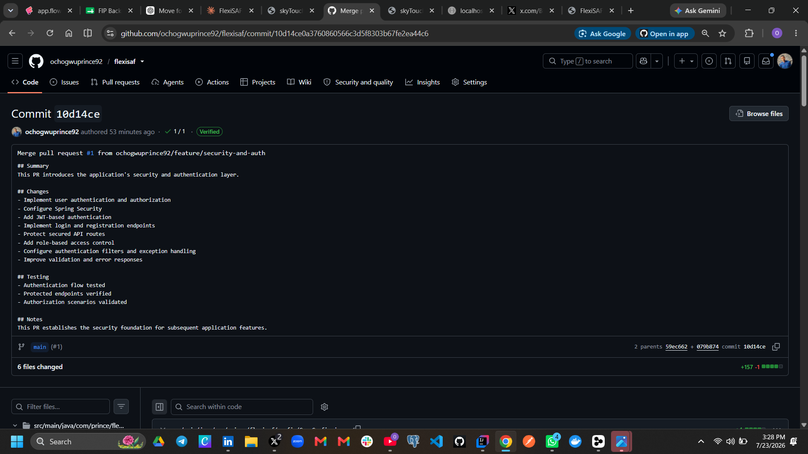
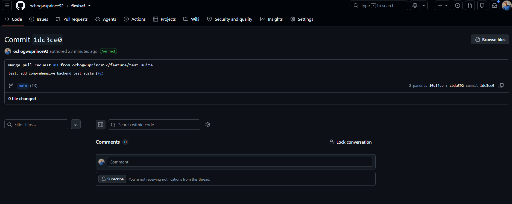

# FlexiSAF — Spring Boot REST API

A production-ready RESTful API built with Java 21 and Spring Boot, backed by PostgreSQL and managed with Maven. This project demonstrates clean backend architecture following industry best practices including layered design, input validation, structured error handling and database integration.

## Tech Stack

| Layer | Technology |
|-------|-----------|
| Language | Java 21 |
| Framework | Spring Boot 3.4 |
| Database | PostgreSQL 15 |
| ORM | Spring Data JPA / Hibernate |
| Build Tool | Maven 3.9 |
| Application Server | Embedded Tomcat (Spring Boot) |
| Validation | Jakarta Bean Validation |
| Code Reduction | Lombok |


# ERD

Logistics Database Schema Design (High-Level)

A logistics system typically manages shipments, deliveries, tracking, vehicles, drivers, warehouses, and customers. Below is a clean relational schema that models how goods move from sender to receiver.

The system supports:

Shipment creation and tracking
Pickup and delivery operations
Warehouse storage management
Vehicle and driver assignment
Real-time shipment status updates
Customer order delivery lifecycle


## RELATIONSHIPS
    CUSTOMERS ||--o{ SHIPMENTS : places

    SHIPMENTS ||--o{ PARCELS : contains
    SHIPMENTS ||--o{ TRACKING_EVENTS : has
    SHIPMENTS ||--|| PAYMENTS : paid_by
    SHIPMENTS ||--|| SHIPMENT_ASSIGNMENTS : assigned_to

    DRIVERS ||--o{ SHIPMENT_ASSIGNMENTS : drives
    VEHICLES ||--o{ SHIPMENT_ASSIGNMENTS : uses
    ROUTES ||--o{ SHIPMENT_ASSIGNMENTS : follows

## ENTITIES
    CUSTOMERS {
        bigint customer_id PK
        string full_name
        string phone
        string email
        text address
        timestamp created_at
    }

    SHIPMENTS {
        bigint shipment_id PK
        bigint customer_id FK
        text origin
        text destination
        string status
        decimal weight_kg
        timestamp created_at
    }

    PARCELS {
        bigint parcel_id PK
        bigint shipment_id FK
        text description
        decimal weight
        boolean fragile
    }

    TRACKING_EVENTS {
        bigint event_id PK
        bigint shipment_id FK
        string status
        text location
        timestamp timestamp
    }

    PAYMENTS {
        bigint payment_id PK
        bigint shipment_id FK
        decimal amount
        string method
        string status
    }

    SHIPMENT_ASSIGNMENTS {
        bigint assignment_id PK
        bigint shipment_id FK
        bigint driver_id FK
        bigint vehicle_id FK
        bigint route_id FK
    }

    DRIVERS {
        bigint driver_id PK
        string full_name
        string phone
        string license_number
        string status
    }

    VEHICLES {
        bigint vehicle_id PK
        string plate_number
        string type
        decimal capacity_kg
        string status
    }

    ROUTES {
        bigint route_id PK
        text origin
        text destination
        int estimated_time_min
    }

## Available Endpoints

| Method | Endpoint                                      | Description             |
| ------ | --------------------------------------------- | ----------------------- |
| POST   | `/api/shipments`                              | Create a new shipment   |
| GET    | `/api/shipments`                              | Retrieve all shipments  |
| GET    | `/api/shipments/{id}`                         | Retrieve shipment by ID |
| PATCH  | `/api/shipments/{id}/status?status=DELIVERED` | Update shipment status  |
| DELETE | `/api/shipments/{id}`                         | Delete shipment         |


# Version Control Task

## Project Overview

This repository demonstrates the use of Git and GitHub for version control and collaborative development practices. It showcases branching strategies, pull requests, commit history, branch management, reverting commits, and repository documentation.

---

## Feature Branches

### feature/security-and-auth
**Purpose**
Implemented the authentication and authorization module.

**Major Changes**
- Added AuthRequest DTO
- Added AuthResponse DTO
- Implemented AuthService
- Configured Spring Security
- Added AuthController
- Configured authentication endpoints

### feature/test-suite
**Purpose**
Added automated testing for the application.

**Major Changes**
- Added base testing configuration
- Added TestDataFactory
- Added ShipmentServiceTest
- Added UserServiceTest
- Added UserControllerTest
- Added UserIntegrationTest

---

## Pull Requests

| Branch | Purpose | Status |
|---------|----------|--------|
| feature/security-and-auth | Authentication implementation | Merged |
| feature/test-suite | Test suite implementation | Merged |

Screenshots of both merged pull requests are included below.



---

## Git Commands Frequently Used

```bash
git init
git status
git add .
git commit -m ""
git branch
git checkout
git checkout -b
git push origin
git pull origin
git fetch origin
git merge
git stash
git stash pop
git revert
git branch -m
git remote -v
```

---

## Revert Demonstration

An intentional change was made to the main branch and reverted using:

```bash
git revert HEAD
```

This preserved the commit history while safely undoing the unwanted change.

---

## Branch Rename

The testing branch was renamed using:

```bash
git branch -m feature/testing feature/test-suite
git push origin feature/test-suite
git push origin --delete feature/testing
git fetch origin
```

---

## Lessons Learned

- Importance of working on feature branches instead of directly on main.
- Writing meaningful commit messages improves project history.
- Pull requests make collaboration and code reviews easier.
- Git revert is safer than rewriting history when undoing mistakes.
- Fetching keeps local references synchronized with remote repositories.
- Renaming branches requires updating both local and remote repositories.
- Small, focused commits make reviewing code significantly easier.

---

## Author
**Ochogwu Prince**
GitHub: [@ochogwuprince92](https://github.com/ochogwuprince92)